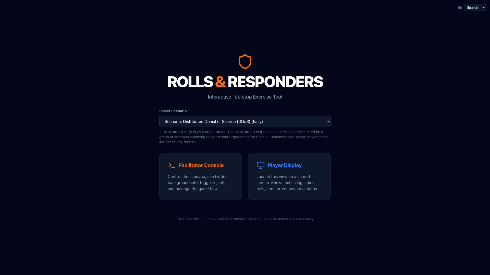
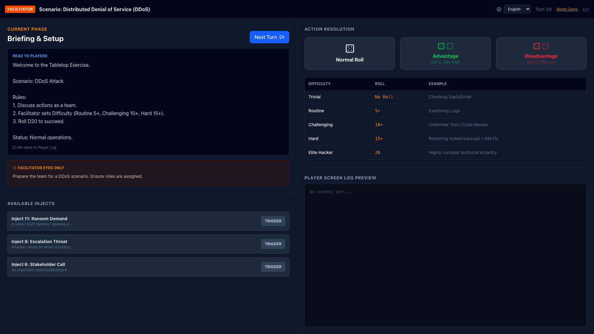
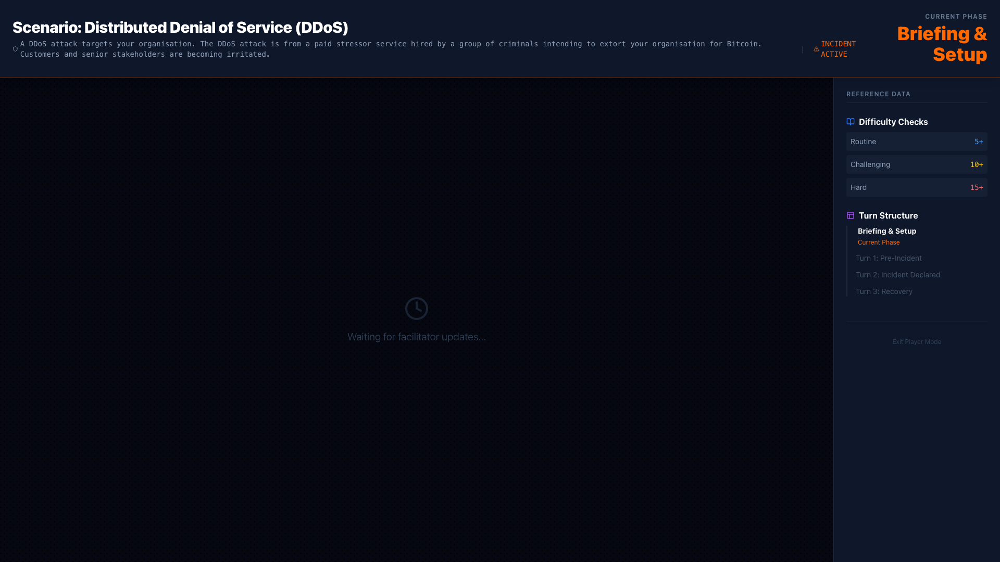
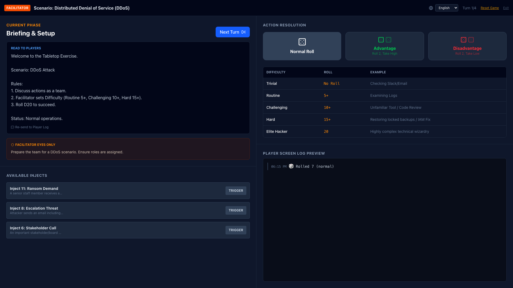
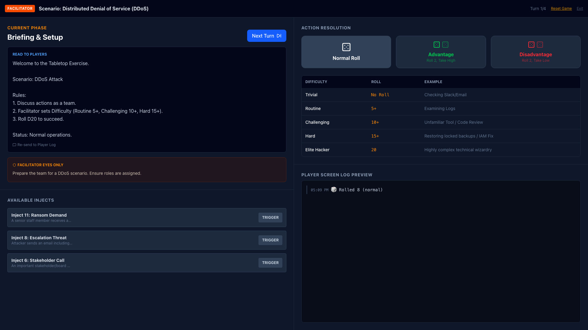

# Rolls & Responders

[](https://github.com/joris-decombe/rolls-and-responders-app/actions)

An interactive tabletop exercise application for testing cybersecurity incident response plans.

Based on the [NCSC New Zealand "Rolls & Responders"](https://www.ncsc.govt.nz/protect-your-organisation/rolls-and-responders/) framework (Creative Commons Attribution 4.0 NZ).



## Features

- **Dual-View Architecture**: Separate facilitator console and player display that sync via localStorage
- **Scenario Library**: 3 official NCSC NZ scenarios (DDoS, Ransomware, Cloud Compromise)
- **D20 Dice System**: Advantage/Disadvantage mechanics for action resolution
- **Dynamic Injects**: Facilitator can trigger unexpected events during gameplay
- **Cross-Tab Sync**: Open in multiple windows for simultaneous facilitator/player views

## Quick Start

```bash
# Install dependencies
npm install

# Start development server
npm run dev
```

Open http://localhost:5173 in two browser windows:
1. **Window 1**: Select "Facilitator Console"
2. **Window 2**: Select "Player Display" (project on shared screen)

## Screenshots

### Facilitator Console
The facilitator view shows hidden background information, controls game flow, triggers injects, and manages dice rolls.



### Player Display
The player view shows only public information - current phase, event logs, and dice results.



### Dice Rolling System
D20-based action resolution with advantage/disadvantage mechanics.



### Dynamic Injects
Facilitators can trigger unexpected events during gameplay.



## Scenarios

### 1. DDoS Attack (Easy)
**Code**: 4452
Paid stressor service hired by criminals for Bitcoin extortion. Tests availability response and stakeholder communication.

### 2. Ransomware (Medium)
**Code**: 1456
Security tester USB attack on admin laptop. Tests backup recovery and incident disclosure.

### 3. Cloud Infrastructure Compromise (Hard)
**Code**: 6244
Misconfigured access keys lead to PII exfiltration. Tests data breach response and media handling.

## How to Play

1. **Choose a scenario** on the landing page
2. **Facilitator**: Controls game flow, sees hidden information, triggers injects
3. **Players**: Discuss actions as a team, roll dice for outcomes
4. **Difficulty**: Facilitator sets (Routine 5+, Challenging 10+, Hard 15+)
5. **Advance**: Click "Next Turn" to progress through phases

## Dice Rolling

- **Normal**: Roll 1 D20
- **Advantage**: Roll 2 D20, take higher (team has resources/help)
- **Disadvantage**: Roll 2 D20, take lower (fatigued/under pressure)

## Tech Stack

- React 19
- Vite
- Tailwind CSS 4
- lucide-react icons

## Source Material

Scenarios and mechanics from NCSC NZ Rolls & Responders:
- Facilitator Manual V1.1
- Game Manual V1
- Quick Guides

**Official Resources**:
- [NCSC NZ Rolls & Responders](https://www.ncsc.govt.nz/protect-your-organisation/rolls-and-responders/)

Original concept by Kate Pearce & TradeMe NZ via NZITF.

## License

This application is based on NCSC NZ Rolls & Responders, licensed under [Creative Commons Attribution 4.0 New Zealand](https://creativecommons.org/licenses/by/4.0/).

## Contributing

We welcome contributions! See [CONTRIBUTING.md](CONTRIBUTING.md) for guidelines on:
- Adding new scenarios
- Updating screenshots
- Development setup
- Code style

## Development

See [CLAUDE.md](CLAUDE.md) for architecture details and development guidelines.
